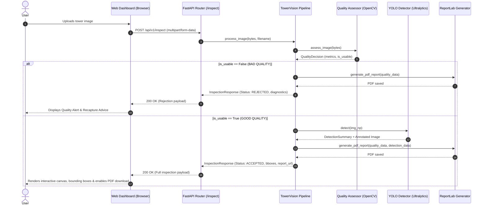

# 🗼 TowerVision AI — Comprehensive Codebase & Architecture Guide

This document provides a detailed, file-by-file breakdown of the **TowerVision AI** platform. It explains the purpose, mathematical algorithms, data structures, and interactions between every component in the system.

---

## 📑 Table of Contents
1. [High-Level Architecture & Pipeline](#1-high-level-architecture--pipeline)
2. [Complete Directory Tree](#2-complete-directory-tree)
3. [Detailed File-by-File Breakdown](#3-detailed-file-by-file-breakdown)
   - [Backend Core & Configuration](#backend-core--configuration)
   - [Stage 1: Image Quality Assessment Engine](#stage-1-image-quality-assessment-engine)
   - [Stage 2: YOLO Detection Engine](#stage-2-yolo-detection-engine)
   - [Pydantic Schemas & Data Contracts](#pydantic-schemas--data-contracts)
   - [Services & PDF Generation](#services--pdf-generation)
   - [Frontend Web Dashboard](#frontend-web-dashboard)
   - [Testing & Quality Assurance](#testing--quality-assurance)
4. [Mathematical Principles & CV Metrics](#4-mathematical-principles--cv-metrics)
5. [End-to-End Request Lifecycle](#5-end-to-end-request-lifecycle)
6. [How to Run & Develop](#6-how-to-run--develop)

---

## 1. High-Level Architecture & Pipeline

TowerVision AI is designed around a **Quality-Aware AI Pipeline**:

```
[ User Uploads Image ]
          │
          ▼
┌─────────────────────────────────┐
│ Stage 1: Quality Engine (Fast)  │  ◄── Laplacian Blur, Brightness, Contrast Checks
└────────────────┬────────────────┘
                 │
          Quality Decision
           ┌─────┴─────┐
           │           │
        ❌ BAD       ✅ GOOD
           │           │
           ▼           ▼
   [ REJECT FLOW ]   ┌─────────────────────────────────┐
   Generate Actionable│ Stage 2: YOLO Detection Engine │  ◄── Detect Mast, Antennas, Defects
   Diagnostics & Advice└───────────────┬─────────────────┘
           │                           │
           └───────────┬───────────────┘
                       ▼
         ┌───────────────────────────┐
         │ Stage 3: Result Engine    │  ◄── Merge Metrics + BBoxes + Audit Logs
         └─────────────┬─────────────┘
                       │
         ┌─────────────┴─────────────┐
         ▼                           ▼
  [ Web Dashboard ]        [ PDF Inspection Report ]
```

### Why Quality Gating Matters
1. **Prevents Hallucinations & False Defects**: Running deep learning models on blurry or heavily underexposed photos causes missed components and false defect alarms.
2. **Saves GPU & Cloud Compute**: Fast OpenCV heuristics ($<15\text{ms}$) filter out unusable drone shots before executing expensive neural network inference ($150-500\text{ms}$).
3. **Actionable Field Guidance**: Instead of failing silently, field operators receive immediate instructions on how to recapture the photo (e.g., *"Focus blurred: variance 34 < 100"*).

---

## 2. Complete Directory Tree

```text
TowerVision-AI/
├── .env.example                       # Template for environment configuration
├── .gitignore                         # Ignore rules for virtualenvs, caches, storage & weights
├── README.md                          # Project overview and high-level mission
├── ARCHITECTURE.md                    # This comprehensive codebase guide
│
├── backend/
│   ├── requirements.txt               # Pinned Python package dependencies
│   ├── app/
│   │   ├── __init__.py                # Package root
│   │   ├── main.py                    # FastAPI app entrypoint, CORS & static file mounting
│   │   ├── config.py                  # Threshold constants, paths, and environment settings
│   │   │
│   │   ├── api/
│   │   │   ├── __init__.py
│   │   │   └── routes.py              # REST API endpoints (/inspect, /quality-check, /report)
│   │   │
│   │   ├── core/
│   │   │   ├── __init__.py
│   │   │   └── pipeline.py            # Master pipeline orchestrator (Quality -> YOLO -> Report)
│   │   │
│   │   ├── quality/                   # STAGE 1: Quality Assessment
│   │   │   ├── __init__.py
│   │   │   ├── metrics.py             # Pure OpenCV calculations (Laplacian, luminance, contrast)
│   │   │   ├── rules.py               # Threshold evaluations & recommendation engine
│   │   │   └── assessor.py            # High-level Quality Assessor coordinator
│   │   │
│   │   ├── detection/                 # STAGE 2: YOLO Object Detection
│   │   │   ├── __init__.py
│   │   │   ├── detector.py            # Ultralytics YOLO loader & inference runner
│   │   │   └── postprocessing.py      # Bounding box rendering, color mapping & badges
│   │   │
│   │   ├── schemas/                   # Pydantic Data Models (Type safety & JSON schemas)
│   │   │   ├── __init__.py
│   │   │   ├── quality.py             # QualityMetrics and QualityDecision schemas
│   │   │   ├── detection.py           # BoundingBox, DetectedObject, DetectionSummary
│   │   │   └── response.py            # Unified API response payloads
│   │   │
│   │   └── services/                  # Output & Document Services
│   │       ├── __init__.py
│   │       └── report_generator.py    # ReportLab PDF audit report compiler
│   │
│   └── tests/
│       └── test_quality.py            # Pytest test suite for CV quality algorithms
│
└── frontend/                          # Web Dashboard (Single Page Application)
    ├── index.html                     # Semantic dashboard layout with drag-and-drop & canvas
    ├── css/
    │   └── styles.css                 # Glassmorphism dark-theme design system
    └── js/
        ├── app.js                     # UI state controller, upload handler & live charts
        └── canvas_renderer.js         # HTML5 Canvas bounding box viewer with hover inspection
```

---

## 3. Detailed File-by-File Breakdown

### Backend Core & Configuration

#### 1. `backend/app/config.py`
- **Purpose**: Centralized application configuration using Pydantic `BaseModel`.
- **Key Parameters**:
  - `MIN_LAPLACIAN_BLUR_SCORE = 100.0`: Minimum variance of Laplacian to qualify as sharp.
  - `MIN_BRIGHTNESS = 40.0` & `MAX_BRIGHTNESS = 220.0`: Acceptable luminance range $(0-255)$.
  - `MIN_CONTRAST_RMS = 25.0`: Minimum standard deviation of pixel intensities.
  - `MIN_IMAGE_WIDTH` & `MIN_IMAGE_HEIGHT = 400`: Minimum resolution limits.
  - `YOLO_MODEL_PATH = "yolov8n.pt"`: Model weights file path.
  - `DETECTION_CONFIDENCE_THRESHOLD = 0.35`: Confidence cutoff for detections.
- **Side Effects**: Automatically creates local directories for `storage/uploads`, `storage/processed`, and `storage/reports`.

#### 2. `backend/app/main.py`
- **Purpose**: Entrypoint for the web server application.
- **Key Features**:
  - Instantiates the `FastAPI` app with metadata and OpenAPI documentation.
  - Configures `CORSMiddleware` to allow web client communication.
  - Registers API routers from `app.api.routes`.
  - Mounts static directories: `/storage` for images and `/` for the frontend SPA.

#### 3. `backend/app/core/pipeline.py`
- **Purpose**: The master orchestrator that implements the quality-aware pipeline.
- **Workflow**:
  1. Generates a unique 8-character `inspection_id` and saves the raw input file.
  2. Calls `quality_assessor.assess_image(image_bytes)`.
  3. **Decision Branch**:
     - **If Bad**: Skips YOLO, generates a rejection PDF report, and returns status `REJECTED_BAD_QUALITY`.
     - **If Good**: Executes `tower_detector.detect(img_np)`, draws bounding boxes, saves the annotated image, generates the complete PDF report, and returns `COMPLETED_ACCEPTED`.

---

### Stage 1: Image Quality Assessment Engine

#### 4. `backend/app/quality/metrics.py`
- **Purpose**: Pure OpenCV and NumPy computer-vision metric calculations.
- **Functions**:
  - `compute_laplacian_variance(image_np)`: Convolves image with a $3\times3$ Laplacian kernel and calculates variance $\sigma^2 = \frac{1}{N}\sum (L(x,y) - \mu)^2$.
  - `compute_brightness_mean(image_np)`: Converts image to `LAB` color space and measures average lightness channel $L$.
  - `compute_contrast_rms(image_np)`: Computes root-mean-square contrast (standard deviation of grayscale intensities).
  - `compute_exposure_clipping(image_np)`: Measures percentage of pure black pixels ($\le 5$) and clipped white pixels ($\ge 250$).

#### 5. `backend/app/quality/rules.py`
- **Purpose**: Compares raw metrics against system thresholds and formats human-readable recommendations.
- **Functions**:
  - `evaluate_quality_rules(...)`: Checks each metric independently. If any fails, adds specific rejection reasons and practical recapture tips.
  - Computes a weighted **Composite Health Score** $(0-100)$:
    $$\text{Health Score} = 0.45 \times \text{Blur}_{\text{norm}} + 0.30 \times \text{Brightness}_{\text{norm}} + 0.25 \times \text{Contrast}_{\text{norm}}$$

#### 6. `backend/app/quality/assessor.py`
- **Purpose**: Coordinator class (`ImageQualityAssessor`).
- **Functions**:
  - `assess_image(image_bytes)`: Decodes raw image bytes via `cv2.imdecode`, invokes metric functions, passes results to rules evaluator, and constructs a structured `QualityDecision` object.

---

### Stage 2: YOLO Detection Engine

#### 7. `backend/app/detection/detector.py`
- **Purpose**: Manages deep-learning object detection for tower structural assets and defects.
- **Class**: `YOLOTowerDetector`
- **Capabilities**:
  - Loads YOLO models (`ultralytics.YOLO`) on GPU (CUDA) or CPU.
  - Maps detected class names into domain-specific tower components (Tower Mast, Antenna Modules, Mount Brackets, Insulators, Rust).
  - Includes a fallback simulator to guarantee seamless test runs and mock demonstrations when offline.
  - Returns a `DetectionSummary` and rendered annotated image.

#### 8. `backend/app/detection/postprocessing.py`
- **Purpose**: Visual presentation of AI detections.
- **Key Features**:
  - `CLASS_COLOR_MAP`: Assigns color codes to components (Cyan for Mast, Purple for Antennas, Green for Mounts, Red for Rust/Defects).
  - `draw_detection_overlay(...)`: Draws bounding boxes with rounded label badges and confidence percentages.

---

### Pydantic Schemas & Data Contracts

- [**`backend/app/schemas/quality.py`**](file:///c:/Users/SHREEVATSA/Documents/Custom%20Office%20Templates/OneDrive/Desktop/TowerVision%20AI/TowerVision-AI/backend/app/schemas/quality.py):
  - `QualityMetrics`: Blur score, brightness, contrast, resolution, composite score, boolean flags.
  - `QualityDecision`: Usability status, reasons, and recommendations.
- [**`backend/app/schemas/detection.py`**](file:///c:/Users/SHREEVATSA/Documents/Custom%20Office%20Templates/OneDrive/Desktop/TowerVision%20AI/TowerVision-AI/backend/app/schemas/detection.py):
  - `BoundingBox`: Normalized / pixel coordinates $(x_{\min}, y_{\min}, x_{\max}, y_{\max}, w, h)$.
  - `DetectedObject`: ID, class name, confidence, bbox, severity (`INFO`/`CRITICAL`), color.
  - `DetectionSummary`: Object count, breakdown dictionary, defect flags, inference runtime in milliseconds.
- [**`backend/app/schemas/response.py`**](file:///c:/Users/SHREEVATSA/Documents/Custom%20Office%20Templates/OneDrive/Desktop/TowerVision%20AI/TowerVision-AI/backend/app/schemas/response.py):
  - `InspectionResponse`: Unified REST response containing metadata, URLs for processed assets, quality reports, and detection tables.

---

### Services & PDF Generation

#### 9. `backend/app/services/report_generator.py`
- **Purpose**: Generates formal, publication-quality PDF audit reports using ReportLab.
- **Report Contents**:
  1. Header with Inspection ID and UTC timestamp.
  2. Stage 1 Quality Table (Laplacian score, luminance, contrast, status).
  3. Rejection reasons and operator instructions (if rejected).
  4. Stage 2 YOLO Component Inventory Table with coordinates and confidence scores (if accepted).

---

### Frontend Web Dashboard

#### 10. `frontend/index.html`
- **Structure**:
  - **Header**: Branding, live pulse badge, version indicator.
  - **Left Panel (Stage 1)**: Drag-and-drop upload zone, sample test buttons (Sharp, Blur, Dark), circular SVG progress ring for quality health score, metric progress bars, and failure alerts.
  - **Right Panel (Stage 2)**: HTML5 `<canvas>` bounding box viewer, statistics pills (total count, defect severity, resolution), inventory tags, and detailed data table.

#### 11. `frontend/css/styles.css`
- **Design System**: Modern dark theme with CSS custom properties (`#0a0e17` background, glassmorphism cards, glowing cyan/purple gradients, and responsive layout).

#### 12. `frontend/js/canvas_renderer.js`
- **Class**: `TowerCanvasRenderer`
- **Capabilities**:
  - Draws the uploaded image to the canvas maintaining natural aspect ratio.
  - Renders bounding box outlines with custom colors and labels.
  - Interactive mouse hover inspection: highlights the hovered bounding box with a glowing drop shadow.
  - Toggles box visibility on/off.

#### 13. `frontend/js/app.js`
- **Controller**:
  - Listens for drag-and-drop and file selection events.
  - Dispatches `POST /api/v1/inspect` requests with `FormData`.
  - Animates the circular quality score gauge and color-coded metric bars.
  - Generates synthetic on-the-fly sample images (Sharp, Blurry, Underexposed) for instant testing without external files.
  - Updates the detection table and activates the PDF download button.

---

### Testing & Quality Assurance

#### 14. `backend/tests/test_quality.py`
- **Purpose**: Automated test suite using `pytest`.
- **Test Cases**:
  - `test_sharp_vs_blurry_image()`: Verifies that Laplacian variance correctly ranks sharp images higher than blurred ones.
  - `test_underexposed_image()`: Verifies that low-luminance images trigger quality rejection with underexposure failure messages.
  - `test_good_quality_image()`: Verifies that high-resolution, clear images pass all quality gates with scores $> 70$.

---

## 4. Mathematical Principles & CV Metrics

### 1. Laplacian Focus Measure (Blur Detection)
The Laplacian operator $\nabla^2 f$ computes the 2nd spatial derivative of an image:
$$\nabla^2 f = \frac{\partial^2 f}{\partial x^2} + \frac{\partial^2 f}{\partial y^2}$$
Applied with the standard discrete kernel:
$$K = \begin{bmatrix} 0 & 1 & 0 \\ 1 & -4 & 1 \\ 0 & 1 & 0 \end{bmatrix}$$
The focus measure is the variance $\text{Var}(\nabla^2 f)$. A high variance indicates rapid intensity transitions (sharp edges), while low variance indicates blur.

### 2. Root-Mean-Square (RMS) Contrast
$$C_{\text{RMS}} = \sqrt{\frac{1}{M \cdot N} \sum_{i=0}^{N-1} \sum_{j=0}^{M-1} (I(i,j) - \bar{I})^2}$$
Where $\bar{I}$ is the mean intensity. Low $C_{\text{RMS}}$ indicates foggy, washed out, or low dynamic-range imagery.

---

## 5. End-to-End Request Lifecycle



---

## 6. How to Run & Develop

### 1. Install Dependencies
```powershell
cd "c:\Users\SHREEVATSA\Documents\Custom Office Templates\OneDrive\Desktop\TowerVision AI\TowerVision-AI\backend"
pip install -r requirements.txt
```

### 2. Run Automated Tests
```powershell
pytest tests/ -v
```

### 3. Launch Development Server
```powershell
uvicorn app.main:app --reload --port 8000
```

- **Dashboard UI**: `http://localhost:8000`
- **Interactive Swagger Docs**: `http://localhost:8000/docs`
- **Alternative ReDoc**: `http://localhost:8000/redoc`
